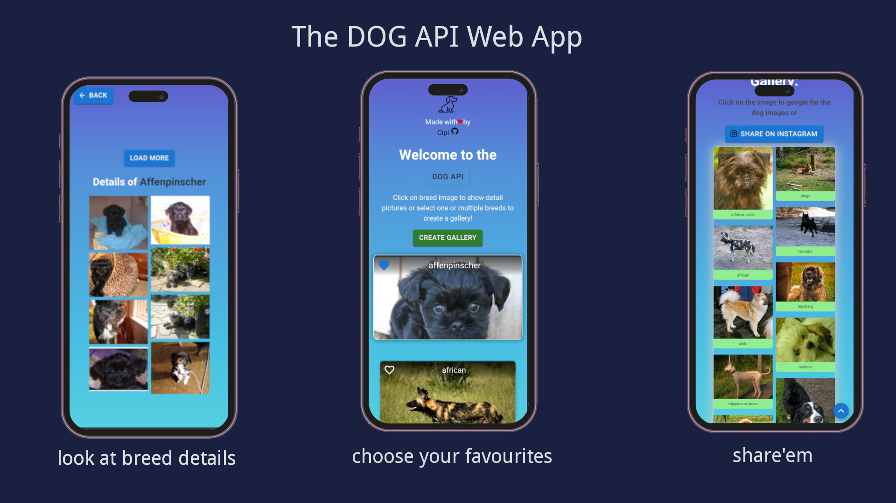

# Dog Breed App

## Table of contents

- [Overview](#overview)
  - [Idea](#idea)
  - [Live Site](#live-site)
  - [Screenshots](#screenshot)
- [Tasks](#tasks)
  - [Features](#features)
  - [App Structure](#app-structure)
- [Tools](#tools)
- [Author](#author)
- [Acknowledgments](#acknowledgments)

## Idea
- create a small app using React.js, Typescript and Material UI. The app will allow users to view an image gallery of their favorite dog breeds using the [DOG API](https://dog.ceo/dog-api/). 

## Live Site
- [live website](https://main--dog-gallery-api.netlify.app/)

## Screenshot

## Tasks
- [x] integrate the dog api to fetch and display images of selected dog breeds
- [x] implement a user interface with Material UI that allows users to select one or more dog breeds
- [x] display images of the selected breeds in a gallery format
- [] [test app with Jest and React Testing Library ](https://www.freecodecamp.org/news/how-to-test-react-applications/)

### Features
- [x] scroll to top button/icon
- [x] spinner component
- [x] add favicon
- [x] navigate back button
- [x] "create gallery" button only enabled if favorites are chosen 
- [] add 404 page
- [x] set link to DOG API
- [x] share gallery with instagram tag #dog
- [x] in gallery click on image to search google for more images

## App Structure
- route: "/"
    - get a card list with: 
        a) random breed list
        b) app-bar including: heart-icon and breed name
        c) click on heart for selecting favorite breed(s)
        d) click on bg-img to move on to BreedDetail with Gallery pics of breed
        e) click on button "create gallery" for creating a gallery of chosen breeds

- route: "/breed/:hound"
    - i.e. /breed/affenpinscher
    shows BreedDetail of "Affenpinscher" in Gallery

- route: "/gallery"
    - show a gallery of chosen breeds

## Tools
- Mobile First Approach
- ReactJs / Typescript
- Material UI
- vite

## Acknowledgments
- [DOG API](https://dog.ceo/dog-api/about)
